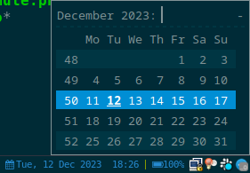

# rofi-calendar

A minimal calendar pop up in rofi when clicking the date blocklet



## Dependencies

- Rust language for building (Packages: glib, urlencoding, clap)
- [rofi](https://github.com/davatorium/rofi)

## Installation

1. Clone repository
2. Build with `cargo build --release`
3. Copy `target/release/rofi-calendar` to your directory of choice, e.g. `~/.i3blocks/blocklets`
4. Give it execution permission (`chmod +x rofi-calendar`)
5. Add the following blocklet to your i3blocks.conf:

```ini
[rofi-calendar]
command=$SCRIPT_DIR/rofi-calendar
interval=60
# FORMAT_DATE=%B %Y # date format for rofi -dmenu prompt. Defaults to `%B %Y`
# SHOW_WEEK=true  # whether or not to show number of weeks in calendar. Possible values `true` or `false`. Defaults `true`.
# MONDAY=true # If `true` starts weeks from Monday, else - from Sunday. Defaults to `true`.
# LABEL= 
# DATEFTM=%a, %e %b %Y  %H:%M  # print out datetime format
# SHORTFMT=%a, %e %b %Y  # short print out datetime format
# Y_OFFSET=-20  # rofi window y-offset in px. Defaults to -20.
```

## Key bindings in pop up calendar

- Left - list one month before
- Right - list one month forward
- Control+Left - list one year before
- Control+Right - list one year forward
- Esc - exit
